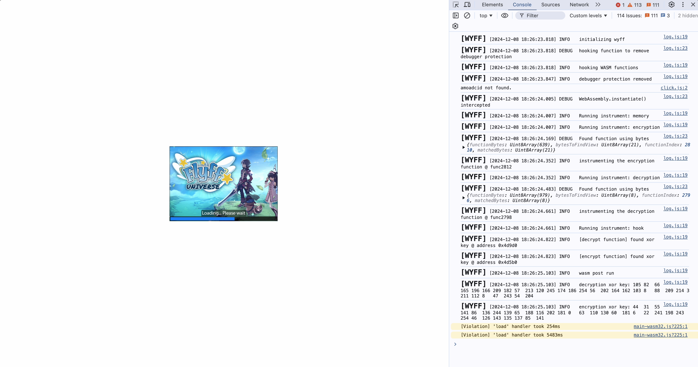

# Flyff Universe debugging extension

I worked on this about 8 months ago. This extension removes debugging
protection (breakpoint spamming) and extracts the Flyff Universe xor keys to decrypt
network packets. It dumps a bunch of information to the console to make reverse
engineering the networking protocol easier.

This project does not contain a full reverse engineer of the networking protocol.
It just decrypts the packets. The actual packet format is not known, but there
are attempts in this extension to make sense of it. As you read through the code,
just know that there are a lot of assumptions about how to read the decrypted
packets. Some are right, but it's mostly wrong. The only thing that is actually
known for sure is the sending/receiving encryption keys.




It also has some memory searching functions that can help find strings in memory.

```
wyff.memoryWrapper.search("ascii", "Lv: ", 0x000000, 0xFFFFFF); // search for string 'Lv: '
```

# Installing the extension

only tested on Chrome

1. Load Unpacked Extension on this repository
2. Load the game. In the devtools, it will dump network traffic in Verbose mode.

## Making changes

1. clone the repo
2. `cd src/`
2. `npm install`
3. `npm run dev`